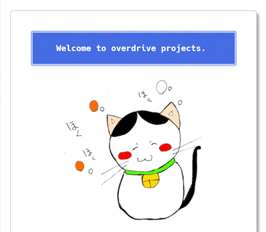
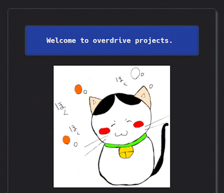

   
  <h1>
Dark knight
</h1>
   
  
Status: Per-endpoint authorization🎯

   
    
 Mozilla FireFox 🦊

    
    
 Google Chrome 🟢

    
   
  <h5>
Run mix setup to install and setup dependencies
</h3>
  <h5>
Start Phoenix endpoint with mix phx.server or inside IEx with iex -S mix phx.server
</h3>
  <h5>
Now you can visit <a href="http://localhost:4000">localhost:4000</a> from your browser.
</h3>
   

